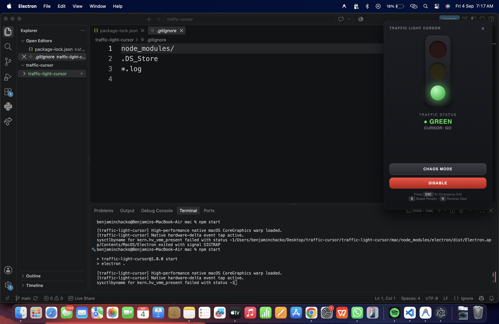
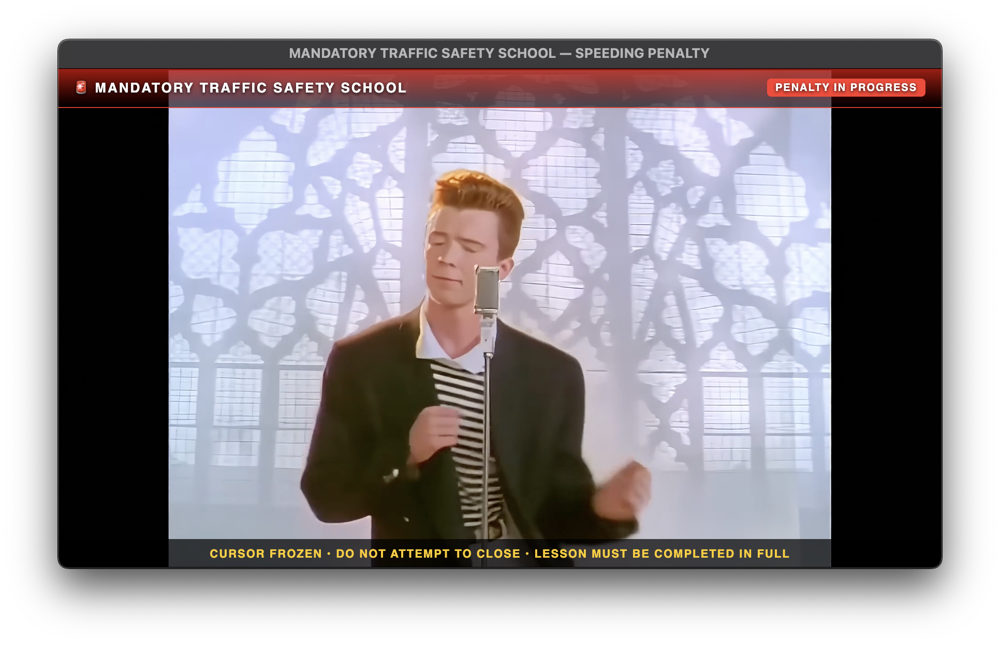
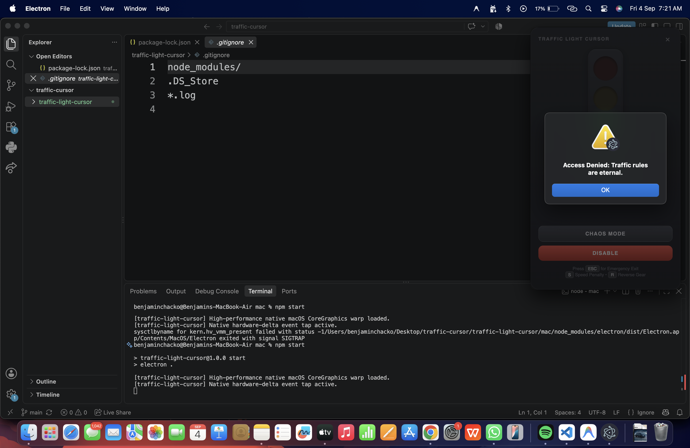
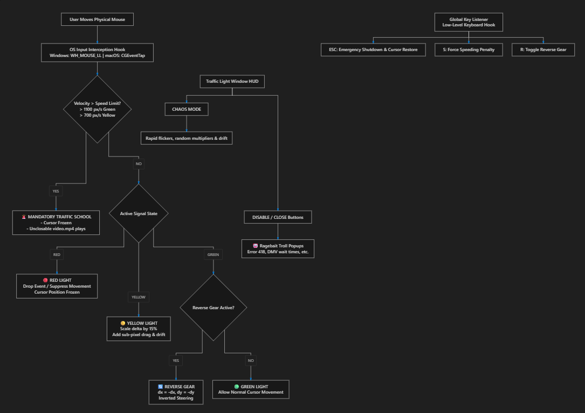

# Traffic Light Cursor 🚦🎯

## Basic Details
### Team Name: Traffic Violators

### Team Members
- Team Lead: Athulraj R - Muthoot Institute of Technology & Science
- Member 2: Benjamin Chacko - Muthoot Institute of Technology & Science

### Project Description
Traffic Light Cursor is an intentionally useless desktop application that forces real-world municipal road rules onto your operating system mouse cursor. Intercepting input deep within the OS event pipeline, it halts your pointer on Red, slashes cursor speed to a crawl on Yellow, throws steering into Reverse Gear, and sentences reckless speeders to an unclosable mandatory traffic safety school video!

### The Problem (that doesn't exist)
Modern desktop computing has an uncontrolled speeding problem. For decades, computer users have been recklessly whipping their mouse pointers across high-refresh-rate multi-monitor displays at breakneck velocities. There were no speed limits, no traffic lights, no mandatory pedestrian crossings, and zero accountability for reckless scrolling and aggressive cursor handling.

### The Solution (that nobody asked for)
We built a ruthless, desktop-anchored traffic enforcement system for Windows and macOS. Backed by low-level OS input hooks (`WH_MOUSE_LL` on Windows and CoreGraphics `CGEventTap` on macOS), it takes full authoritarian control of your physical mouse cursor:
- 🔴 **Red Light**: Completely immobilizes the cursor. No matter how hard you drag your mouse, it will not budge.
- 🟡 **Yellow Light**: Slashes cursor sensitivity to a sluggish 15% crawl speed with sticky sub-pixel drag.
- 🟢 **Green Light**: Full-speed cruising—until sudden road hazards strike!
- 🚨 **Speeding Violations**: Flicking or swiping the cursor faster than the posted pixel speed limit immediately triggers a violation, freezing the mouse and forcing you to sit through an unclosable traffic safety video (`video.mp4`).
- 🔄 **Reverse Gear**: Every alternating cycle, mouse steering axes invert completely (up is down, left is right).
- 🌀 **Hyper-Chaos Mode**: Randomized rapid lamp flickering, speed multiplier swings, erratic drift, and involuntary control reversals.
- 🤡 **Fake Troll Buttons**: The "DISABLE" and "Close" (`X`) buttons are ragebait traps that throw bureaucratic error popups (*"Error 418: I am a coconut"*, *"Your disable request has been submitted to the DMV. Estimated wait time: 4 to 6 weeks"*).
- 🛑 **Emergency Escape**: The global `ESC` key is your only legal escape hatch to terminate the app and restore your system cursor.

## Technical Details
### Technologies/Components Used
For Software:
- **Languages used**: C++ (C++17 for Windows), JavaScript (ES6+ / Node.js for macOS), C (CoreGraphics native C module)
- **Frameworks used**: Electron (cross-platform desktop runtime for macOS), Win32 API / GDI (lightweight, zero-dependency native Windows GUI)
- **Libraries used**:
  - *Windows*: Windows SDK (`user32`, `gdi32`, `comctl32`), Windows Media Foundation (`mfplat`, `mfplay` for hardware-accelerated video playback)
  - *macOS*: CoreGraphics / Quartz Event Services (`CGEventTap`, `CGEventPost`), `uiohook-napi` (global low-level hotkeys & velocity tracking), `@nut-tree-fork/nut-js`
- **Tools used**: CMake (3.16+), MinGW-w64 (GCC/G++), Node.js (v18+), npm, node-gyp, Git

### Implementation
For Software:

# Installation

#### Prerequisites:
- **Windows**: MinGW-w64 (GCC/G++ with `gdi32`, `user32`, `mfplay` support) and CMake (3.16+).
- **macOS**: Node.js 18+, npm, and macOS Accessibility / Input Monitoring permissions.

#### Clone repository:
```bash
git clone https://github.com/athulraj-r/trafffic-light-cursor.git
cd trafffic-light-cursor
```

#### Windows Setup:
```bash
cd windows
# Configure and build using CMake and MinGW:
mkdir build && cd build
cmake -G "MinGW Makefiles" ..
cmake --build . --config Release

# Or simply run the automated build script:
..\build.bat
```

#### macOS Setup:
```bash
cd mac
npm install
npm run build:native   # Compiles native CoreGraphics warp.node module
```

# Run

#### On Windows:
```bash
cd windows\build
.\traffic_light.exe
```

#### On macOS:
```bash
cd mac
npm start
```
> **Note for macOS:** Ensure Accessibility and Input Monitoring permissions are granted to your terminal app or Electron under **System Settings → Privacy & Security**.

### Controls & Hotkeys

| Control / Key | Action |
|---|---|
| `ESC` (Global) | **Emergency Exit** — Immediately terminates the app and restores standard OS cursor behavior |
| `S` (Global) | **Force Speeding Violation** — Triggers the mandatory traffic school penalty video |
| `R` (Global) | **Toggle Reverse Gear** — Inverts horizontal and vertical mouse steering axes |
| **CHAOS MODE** Button | Toggles hyper-erratic signal cycles, jitters, drift, and inverted controls |
| **DISABLE** Button | Fake button! Spawns ragebait troll popups from the Traffic Authority |
| **Close ("X")** Button | Fake button! Spawns unhelpful bureaucratic rejection popups |

### Project Documentation
For Software:

# Screenshots

*Desktop Traffic Light Signal Widget displaying active signal status and cursor state*


*Speeding Penalty Popup*


*Ragebait bureaucratic popup triggered when attempting to click Disable or Close*

# Diagrams

*Architecture and input pipeline workflow of the Traffic Light Cursor system*

### Project Demo
# Video
The application bundles a built-in penalty demo video:
- [Video Demo](./assets/video.mp4)
*Demonstrates the program working*

# Additional Demos
- Windows Standalone Executable: Built to `windows/build/traffic_light.exe`
- macOS Native App: Runnable via `npm start` in `mac/`

## Team Contributions
- Athulraj R : Windows Version (Win32 low-level hooks, GDI render loop, Media Foundation video integration, and CMake configuration)
- Benjamin Chacko : Mac Version (Electron app, native CoreGraphics event tap `warp.c`, keyboard hooks, UI styling, and penalty management)

---
Made with ❤️ at TinkerHub Useless Projects 


